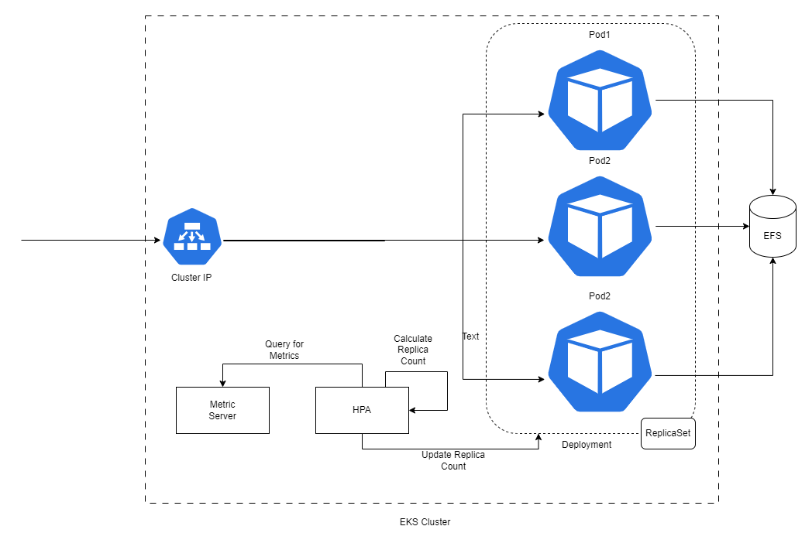

# GeoTax Application Helm Charts

## Motivation

1. **Simplify Deployment:**
    - Streamline the GeoTax SDK deployment process.
    - Ensure an effortless deployment experience.
    - Eliminate complexities for users when setting up the SDK.

2. **Seamless Updates:**
    - Guarantee seamless updates for both data and software.
    - Aim for zero downtime during updates, ensuring uninterrupted service.

3. **Hassle-Free Deployments:**
    - Prioritize user-centric deployment experiences.
    - Minimize potential deployment challenges and issues.

4. **Ready-Made Solution:**
    - Develop a plug-and-play solution for immediate use.
    - Minimize the need for extensive setup or configuration.

5. **Language-Barrier Elimination:**
    - Expose all SDK functionalities as REST endpoints.
    - Allow consumption of these endpoints by any type of client.
    - Eliminate language barriers, enabling broader compatibility.

6. **Microservices Deployment for Scalability:**
    - Create multiple microservices around the SDK.
    - Move away from building a single monolithic application for each SDK functionality.
    - Enhance scalability and flexibility by adopting a microservice architecture.

> This solution is specifically for users who are looking for REST interface to interact with GeoTax SDK and Kubernetes based deployments.

> [!IMPORTANT]
> 1. Please consider these helm charts as recommendations only. They come with predefined configurations that may not be the best fit for your needs. Configurations can be tweaked based on the use case and requirements.
> 2. These charts can be taken as a reference on how one can take advantage of the precisely data ecosystem and build a number of services around the same piece of software, creating a collection of microservices that can scale on a need basis.

## Architecture

 The core of the GeoTax helm-chart-based solution relies on the GeoTax SDK. The robust
functionality of GeoTax SDK forms the backbone of our GeoTax solution, empowering it to deliver accurate and efficient
GeoTax services while maintaining data integrity and usability.

The GeoTax application is designed as a robust microservice-based architecture, utilizing a modular approach to
provide highly optimized, scalable and precise addressing solutions.

### Capabilities

GeoTax Service will provide geographical-based determinations, to determine in which tax jurisdiction a given address is located, and which current tax codes apply.

## Components

- [Reference Data](docs/ReferenceData.md)
- [Docker Images](scripts/eks/images-to-ecr-uploader/README.md#description)
- [Helm Charts](charts/eks/geotax-application/README.md#helm-charts)

## Guides

- [Reference Data Installation](charts/eks/reference-data-setup/README.md)
- [Quickstart Guide](docs/guides/eks/QuickStartEKS.md)
- [Upgrade Guide](docs/guides/eks/UpgradeGuide.md)
- [Uninstall Guide](docs/guides/eks/UninstallGuide.md)

## Setup

- [Local Setup](docker-desktop/README.md)
- [Kubernetes Setup](charts/eks/geotax-application/README.md)

> NOTE: As of now, GeoTax helm chart is only supported for AWS EKS.

## GeoTax Helm Version Chart

Following is the helm version chart against GeoTax PDX docker image version and Helm Release Version.

| Helm Chart Version →   Geotax Docker Image Version (Version/Vintage/ReleaseDate) ↓ | `1.0.0` | `2.0.0` |
|---------------------------------------------------------------------------------------|---------|---------|
| `1.0.0/2024.1/Jan 22, 2024`                                                           | ✔️      | ❌       |
| `1.0.0/2024.4/Apr 18, 2024`                                                           | ✔️      | ✔️      |

## Miscellaneous

- [Metrics](docs/MetricsAndTraces.md#generating-insights-from-metrics)
- [Application Tracing](docs/MetricsAndTraces.md#generating-insights-from-metrics)
- [Logs and Monitoring](docs/MetricsAndTraces.md#generating-insights-from-metrics)
- [FAQs](docs/faq/FAQs.md)

## References

- [Releases](https://github.com/PreciselyData/cloudnative-geocoding-helm/releases)
- [Helm Values](charts/eks/geotax-application/README.md#helm-values)
- [Environment Variables](charts/eks/geotax-application/README.md#environment-variables)
- [GeoTax Service API Usage](charts/eks/geotax-application/README.md#geotax-service-api-usage)

## Links

- [Helm Chart Tricks](https://helm.sh/docs/howto/charts_tips_and_tricks/)
- [Nginx Ingress Controller](https://docs.nginx.com/nginx-ingress-controller/)
